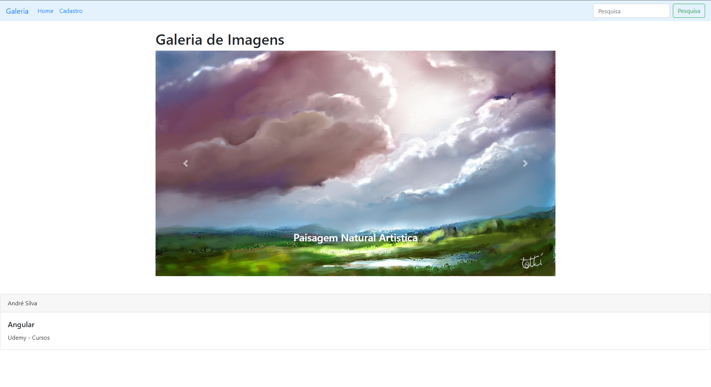

<h2 align="center">
   Projeto WEB de Galeria de Imagens RESTFul.
</h2>

## 📃 Sobre

**Galeria de Imagens**  é projeto Web completo de Galeria de Imagens e CRUD.

## ✨ Features

✔ Aplicações Web moderna com Angular, JavaScript e NodeJs, podendo criar aplicações SPA (Single Page Application) e API RESTFull com Express e MySQL

✔ Home Page Galeria de Imagens com Carousel

✔ CRUD completo via SPA

✔ HTML5 e Ajax Angular e Observables

✔ SPA - Single Page Application

✔ Layout moderno e responsivo com Bootstrap

✔ Componentes com ng-bootstrap 

✔ Icons Font Awesome

✔ API - RESTFul

✔ NodeJs

✔ Express Middleware

✔ JavaScript moderno ES6 com classes, módulos...

✔ MySQL

✔ NPM - Gerenciador de pacotes do Node

✔ Editor Visual Studio Code

## 🚀 Tecnologias utilizadas

Este projeto foi desenvolvido com as seguintes tecnologias:

- NodeJs.

- MySQL.

- Framework Angular.

- HTML5.

- JavaScript.

- Bootstrap.

- Dentre outras.

   

---

<h5 align="center">
  &copy;2023 - <a href="https://github.com/tabsturmab/">André H da Silva</a>
</h5>
